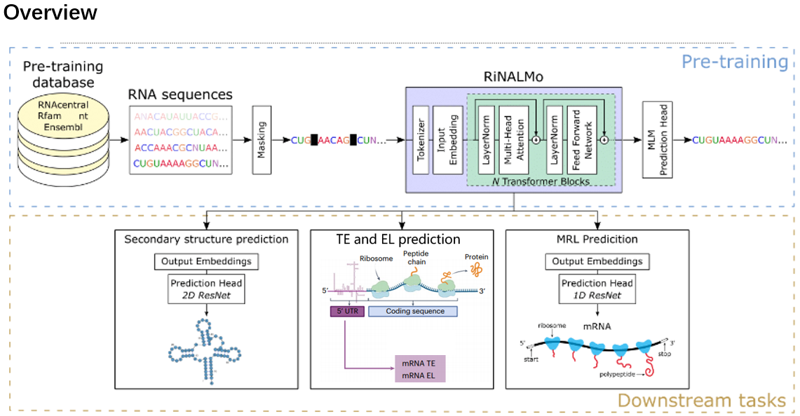

# UTR model pre-training and downstream task fine-tuning
## Introduction
The untranslated region (UTR) of RNA molecules plays a crucial role in the regulation of gene expression. Specifically, the 5' UTR located at the 5' end of the RNA molecule is a key factor in determining the efficiency of RNA translation. This project developed a semi-supervised language model of 5' UTRs that was pretrained on a combined library of random 5' UTRs and endogenous 5' UTRs from multiple species. On the basis of the pre-trained model, some downstream tasks (MRL, TE, EL, SecStructPrediction) were fine-tuned to finally achieve the prediction effect.

## Project progress

At present, the pre-training model tuning has been completed, and the fine-tuning of downstream tasks (MRL, TE, EL, SS) has also been completed, and the acceptable metric range has been reached, for a single prediction of four downstream tasks and an entire fasta file The function of batch prediction and batch saving has been implemented.

## Directory Structure

```

├── debugger.py            # Debugger script
├── LICENSE                # License file
├── pyproject.toml         # Project management configuration file
├── README.md              # Project README file
├── train_ribosome_loading.py        # Script for training ribosome loading model
├── train_sec_struct_prediction.py   # Script for training secondary structure prediction model
├── train_splice_site_prediction.py  # Script for training splice site prediction model
├── train_te_el.py         # Script for TE EL model
│  
├── bash
│   ├── mrl_fine_tuning.sh   # Script for fine-tuning ribosome loading model
│   ├── pretrain_nano.sh     # Script for pre-training nano model
│   ├── ss_fine_tuning.sh    # Script for fine-tuning secondary structure model
│   ├── teel_all_fine_tuning.bash  # Script for comprehensive fine-tuning of transcription elongation model
│   └── teel_fine_tuning.sh  # Script for fine-tuning translation efficiency and expression level model
│  
├── data                    # Training data directory
│   ├── test.fasta          # Predict FASTA file
│   ├── The data has been placed in the same location on server 146.txt  
├── env
│   └── environment.yml     # Environment configuration file
│  
├── ft_schedules
│   ├── giga_mrl_ft.yaml    # Schedule for fine-tuning of ribosome loading model
│   ├── giga_sec_struct_ft.yaml  # Schedule for fine-tuning of secondary structure model
│   └── pretrain.yaml       # Pre-training schedule
│
├── img                     # Illustration picture
│
├── output   # File for prediction results（checkpoints、logs、wandb、predict_result）
│
├── predict
│   ├── mrl_batch_predict.py    # Script for batch prediction of ribosome loading
│   ├── mrl_single_predict.py   # Script for single prediction of ribosome loading
│   ├── ss_batch_predict.py     # Script for batch prediction of secondary structure
│   ├── ss_single_prediction.py # Script for single prediction of secondary structure
│   ├── te_el_batch_predict.py  # Script for batch prediction of translation efficiency and expression level
│   └── te_el_single_predict.py # Script for single prediction of translation efficiency and expression level
│  
└── utr
    ├── config.py            # Configuration file
    ├── train.py             # Pretrained Training script
    ├── data
    │   ├── alphabet.py       # Alphabet class for sequence encoding
    │   ├── constants.py      # Constants definitions
    │   └── downstream
    │       ├── ribosome_loading
    │       │   ├── datamodule.py  # Datamodule for ribosome loading
    │       │   ├── dataset.py     # Dataset for ribosome loading
    │       │   └──
    │       ├── secondary_structure
    │       │   ├── datamodule.py  # Datamodule for secondary structure
    │       │   ├── dataset.py     # Dataset for secondary structure
    │       │   └──
    │       ├── splice_site_prediction
    │       │   ├── datamodule.py  # Datamodule for splice site prediction
    │       │   ├── dataset.py     # Dataset for splice site prediction
    │       │   └──
    │       └── teel
    │           ├── datamodule.py  # Datamodule for translation efficiency and expression level
    │           └── dataset.py     # Dataset for translation efficiency and expression level
    │  
    ├── pretrained
    │   ├── datamodule.py    # Datamodule for pretraining
    │   ├── dataset.py       # Dataset for pretraining
    │   └──
    ├── model
    │   ├── attention.py      # Attention mechanism module
    │   ├── downstream.py     # Downstream task models
    │   ├── model.py          # Main model
    │   ├── modules.py        # Model modules
    │   ├── rope.py           # RopE module
    │   └──
    ├── utils
    │   ├── argparse_utils.py  # Argument parsing utilities
    │   ├── callbacks.py      # Callback functions
    │   ├── constants.py      # Constants definitions
    │   ├── data.py           # Data processing utilities
    │   ├── download.py       # File download utilities
    │   ├── exponential_moving_average.py  # Exponential moving average utilities
    │   ├── finetune_callback.py  # Fine-tuning callback functions
    │   ├── loss.py           # Loss functions
    │   ├── lr_schedulers.py  # Learning rate schedulers
    │   ├── parsers.py        # Parsers
    │   ├── scaler.py         # Scaler
    │   ├── sec_struct.py     # Secondary structure processing utilities
    │   ├── seed.py           # Random seed utilities
    │   ├── splice_site_metrics.py  # Splice site metrics
    │   ├── tensor_utils.py   # Tensor processing utilities
    │   └── zero_to_fp32.py   # Zero to float32 conversion utilities
    └──
```

## Installation
```bash
mamba env create -n env/environment.yml
```
## Data
For a detailed introduction to the data set, see the project documentation.
## Pretrain
```bash
bash bash/pretrain_nano.sh
```
## Downstream fine-tuning
### MRL fine-tuning
```bash
bash bash/mrl_fine_tuning.sh
```
### TE and EL fine-tuning
```bash
bash bash/teel_fine_tuning.sh
```
Which Parameters you MUST to define:
* task_type: Choose from "TE" or "EL"

If you want to train TE and EL tasks on three data sets at the same time, please execute：
```bash
bash bash/teel_all_fine_tuning.sh
```

### SecStruct fine-tuning
```bash
bash bash/ss_fine_tuning.sh
```
## Predict
The prediction task is implemented in two forms, a simple single prediction, and a prediction for batches of fasta files.
```bash
python3 prdict/... .py
```
## Result


Please refer to the document for detailed training and fine-tuning parameters, and downstream task indicators：

[UTR-LM Project documentation](https://ab6fpiz688.feishu.cn/docx/TUGxdRBusoxg9fxHEQFczyjnnLh?from=from_copylink)

## Reference
1、A 5′ UTR language model for decoding 
untranslated regions of mRNA and 
function predictions\
(https://doi.org/10.1038/s42256-024-00823-9)

2、RiNALMo: General-Purpose RNA Language Models Can Generalize Well on
Structure Prediction Tasks\
(https://arxiv.org/abs/2403.00043)
